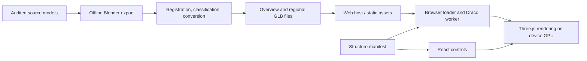

<!-- MIT architecture documentation; anatomy assets retain their respective CC licenses. -->
# Medica anatomy architecture and publishing

## Two separate workflows

The asset pipeline runs on a developer's computer when anatomy changes. The viewer runs in the visitor's browser. Blender and the source archives are not installed on visitors' devices or run for each web request.

## Application files

- `src/app/anatomy-final/page.tsx`: Next.js route and page metadata. Imports the interactive atlas.
- `src/components/anatomy-final/ui.tsx`: React controls, search, system toggles, hierarchy, selected-structure panel, loading/error feedback and slider state. Loads the canonical manifest and connects user actions to the scene.
- `main.ts`: owns Three.js scene, camera, environment lighting, orbit controls, raycasting, selection, render scheduling and disposal. It is deliberately a scene controller rather than React state for every animation frame.
- `loader.ts`: one shared GLTFLoader and DRACOLoader per viewer; priority queue, deduplicated requests, progress, retries and disposal cancellation. Downloads each complete GLB, then decodes it in a worker. Merges geometry by owning system and records decoded index/vertex ranges for each named structure. Regional detail is loaded when selecting a structure; two detail regions remain cached.
- `types.ts`: contracts for the manifest, named parts, source licenses, parent/region memberships and loaded geometry ranges.
- `materials.ts`: vertex colors, tissue roughness and a subtle procedural muscle finish. These are visual styling, not reconstructed tissue histology.
- `study-layout.ts`: deterministic system/name tile packing, normalized sizes and 10px padding per side.
- `study-board.tsx`: scroll/zoom controls, virtualized labels and selection; preserves board scroll position during inspection.
- `study-transition.ts`: reversible 180ms GPU vertex projection morph from the assembled camera to the orthographic study tile positions. Supports every slider percentage without editing master vertex coordinates; reduced motion applies the chosen value immediately.
- `explode.ts`: triangle-to-part lookup used by selection. Obsolete radial helpers and their copied rest-position buffer have been removed.
- `anatomy-final.css`: Medica Poppins/emerald/mint controls and dark canvas styling.
- `credits.tsx`: compact permanent link to `/credits`. `src/app/credits/page.tsx` holds readable source attributions and links to full notices and adapted asset downloads.

## Assets and source pipeline

`public/anatomy-final/atlas/manifest.json` is the anatomy directory: 2,846 canonical named structures, owning system, additional memberships, parent/region, provenance, review status and detail file. It is static data, not a database. A structure can belong to multiple systems without duplicating its underlying source geometry.

The atlas directory contains 11 overview GLBs and 63 regional-detail GLBs, totalling 53.717 MB. A GLB is a downloadable 3D container; Draco compresses its geometry. Regional detail is unsimplified evaluated source geometry, still quantized/compressed. `public/anatomy-final/decoder/` contains the Draco decoding files. These public files must ship with the deployed site.

`fetch-z.mjs` pins and verifies source hashes; `export-z.py` evaluates approved Blender geometry, excludes restricted/uncleared source regions and retains shared transforms. `register-bp.py` computes the single global transform for direct BodyParts3D brain/kidney replacements. `build-atlas.mjs` groups named structures, generates overview and regional assets, compresses them and writes the manifest. `report-atlas.py` writes coverage, provenance and attribution downloads. Audit and source-comparison scripts check generated geometry and hashes. See README.md for exact reproduction commands and source limitations.

## What happens when someone opens the page

1. Next.js delivers the page, React code and styles.
2. React requests the structure manifest; Three.js initializes the camera and renderer.
3. Skeleton downloads first. Draco decoding occurs in a worker, then the browser uploads geometry to its GPU.
4. Hover/toggle requests take priority over idle loading. The other overview systems load in the background. Selecting a structure requests its regional detail.
5. Search matches the manifest's anatomical names locally. Click selection raycasts triangles and resolves the named range. No AI model or database search is involved.
6. Rotation, selection and slider movement request frames. Rendering stops when settled. Leaving the route disposes the viewer and cancels pending work.

The existing Medica shell uses Firebase for its other account features. This atlas adds no database, login/payment backend or dedicated anatomy server. MedNotes Electron and its embedding/search backend are separate from this route.

## Publishing

Current localhost addresses are development previews accessible on the developer's machine. A production host builds and serves the app at an HTTPS domain. Recommended first release: deploy the existing Next.js project as a web app, then optionally add PWA installation.

1. Run the full TypeScript and production build checks. The missing quiz-directory type and asynchronous searchParams typing were corrected during cleanup. The complete Webpack production build passes; this local environment blocks Turbopack helper-port creation.
2. Commit application code, the generated atlas and decoder files, notices and manifest to the deployment repository. Do not require temporary `/tmp` source folders for the normal Next build. Source conversion is a separate authoring step.
3. Import the repository into a Next.js-capable host such as Vercel. Use `npm ci`, `npm run build` and the Next.js preset. Configure the environment variables required by the existing site, including its NEXT_PUBLIC_FIREBASE_* configuration. Never put private service credentials into NEXT_PUBLIC_* variables.
4. Deploy a preview, verify asset URLs/decoding, credits, device performance and existing account flows, then attach the production domain and configure Firebase's authorized domains as required by its sign-in setup.
5. Keep generated model URLs versioned when adding long-lived caching. If bandwidth becomes significant, move model files to object storage/CDN and update manifest URLs, CORS and cache policy. Verify deployed range behavior; complete-file GLB decoding does not provide progressive geometry streaming.

A self-hosted Node server can run `npm run build` followed by `npm start`, with HTTPS/reverse proxy and process management supplied by the host. `npm run dev` is for development, not the production server.

A PWA adds a manifest, app icons and HTTPS installability; offline use additionally needs a deliberate service-worker/cache policy. The atlas is not currently packaged as a PWA or an App Store app. Native-store distribution is a separate packaging, signing and review project. Starting with a hosted web app avoids changing the existing renderer.

Commercial deployment still needs the documented anatomical review, physical-mobile testing and source/license review. ShareAlike applies to adapted model assets; source notices and downloadable adaptations remain available. Existing viewer MIT licensing and asset licensing are distinct from any future subscription backend.

Official deployment references: https://nextjs.org/docs/app/getting-started/deploying ; https://vercel.com/docs/frameworks/full-stack/nextjs ; https://nextjs.org/docs/app/guides/progressive-web-apps . Asset terms: https://creativecommons.org/licenses/by-sa/4.0/ .
